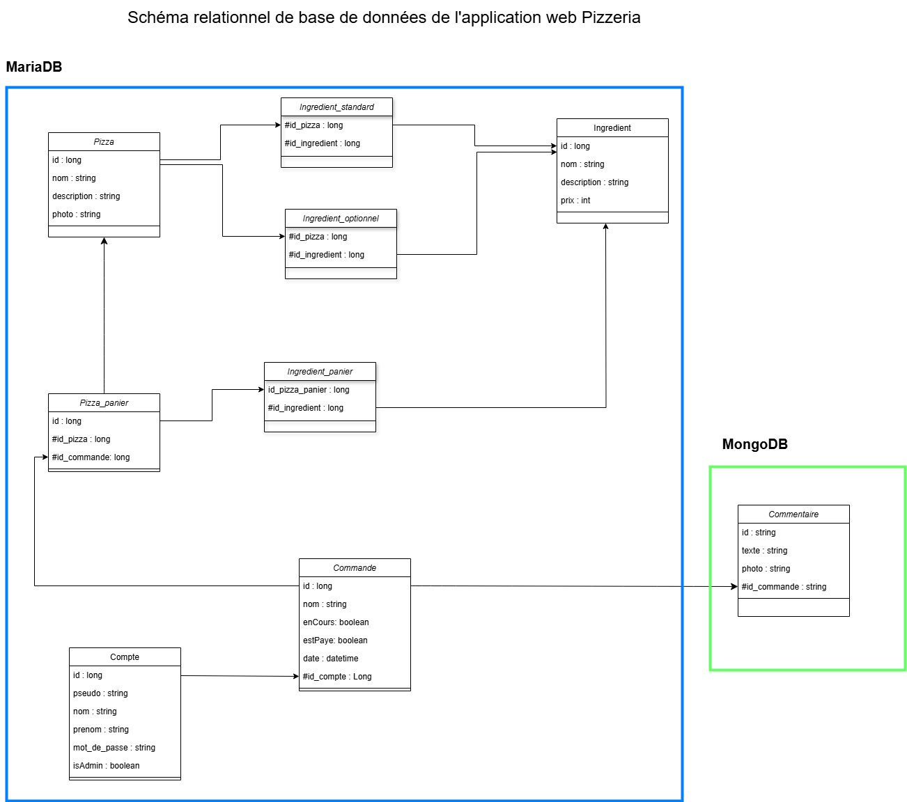

# Pizzeria

## Description Générale
Ce projet est une application web permettant la commande de pizzas personnalisées. Deux types d'utilisateurs interagissent avec le système : les clients, qui s'authentifient, qui consultent le menu, passent commande et laissent des commentaires, et l'administrateur, qui gère les pizzas, les ingrédients, les commandes, les comptes et les statistiques de ventes.

## Technologies utilisées

Java 21  
NodeJS  
ExpressJs 
MariaDB 
MongoDB 
Maven 
Spring Boot  
Spring Data JPA  
Spring Data Mongo  
Spring Security  
Stripe API pour la gestion des paiements  
Jackson pour la gestion des objets JSON  
MapStruct Mappers pour la transformation entre entités et DTO  
Lombock pour les assesseurs,ect ... 
VueJS  
Vue-Router pour les route VueJS 
Chart-JS pour les statistiques 
JWT pour les tokens 
Axios pour les requetes 
Pinia pour le store des informations 

## Fonctionnalités
1. Gestion des Comptes (CompteService)

    Création de comptes utilisateurs avec vérification de l'unicité du pseudo. 
    Récupération des informations d'un compte par identifiant ou par token. 
    Mise à jour des informations d'un compte. 
    Changement de mot de passe avec vérification de l'ancien mot de passe. 
    Suppression d'un compte. 
    Gestion des rôles d'administration. 

2. Authentification (AuthentificationService)

    Vérification des identifiants et des mots de passe des utilisateurs. 
    Gestion de la connexion avec vérification de la correspondance entre le mot de passe saisi et le mot de passe enregistré. 

3. Gestion des Commandes (CommandeService)

    Création de commandes avec vérification des commandes en cours pour un compte. 
    Récupération d'une commande par identifiant ou de la commande en cours pour un utilisateur. 
    Récupération de toutes les commandes. 
    Mise à jour d'une commande (modification du panier). 
    Finalisation d'une commande. 
    Paiement d'une commande via Stripe avec génération d'une session de paiement. 
    Suppression d'une commande. 

4. Gestion des Pizzas (PizzaService)

    Création de nouvelles pizzas avec gestion des ingrédients standard et optionnels. 
    Récupération d'une pizza par identifiant. 
    Récupération de toutes les pizzas disponibles. 
    Mise à jour des informations d'une pizza. 
    Suppression d'une pizza. 

5. Gestion des Paniers de Pizzas (PizzaPanierService)

    Création de paniers de pizzas avec association d'ingrédients. 
    Récupération d'un panier de pizza par identifiant. 
    Récupération de tous les paniers de pizzas. 
    Mise à jour d'un panier de pizza. 
    Suppression d'un panier de pizza. 

6. Gestion des Ingrédients (IngredientService)

    Création de nouveaux ingrédients avec vérification d'unicité. 
    Récupération d'un ingrédient par identifiant. 
    Récupération de tous les ingrédients disponibles. 
    Mise à jour des informations d'un ingrédient. 
    Suppression d'un ingrédient avec vérification d'absence de références dans les pizzas. 

7. Gestion des Commentaires (CommentaireService)

    Création de commentaires associés à une commande, avec enregistrement éventuel d'une image. 
    Récupération d'un commentaire par identifiant. 
    Récupération de tous les commentaires. 
    Mise à jour des commentaires. 
    Suppression d'un commentaire avec mise à jour de la liste des commentaires de la commande associée. 

8. Gestion des Images (ImageService)

    Sauvegarde d'images sur le serveur. 
    Récupération d'une image par son nom de fichier. 
    Vérification des extensions d'image prises en charge (PNG, JPG, JPEG). 
    
## Base de données

## Auteurs
